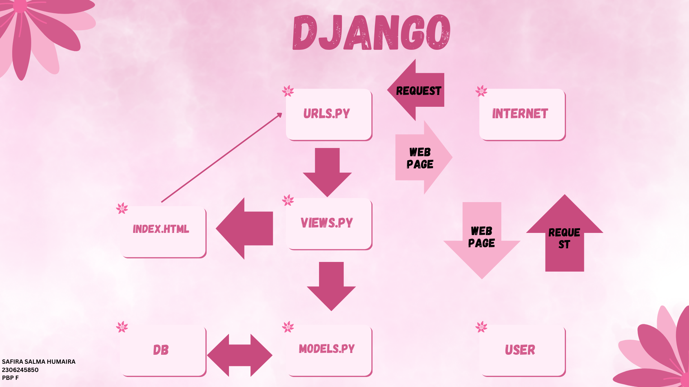

# Delicate - Skincare and Make Up

Ini adalah repository untuk **Delicate**, sebuah aplikasi e-commerce yang dikembangkan untuk **Tugas 2: Pemrograman Berbasis Platform**.

## Deskripsi Proyek
Aplikasi Delicate adalah aplikasi e-commerce yang menjual skincare dan makeup dan memungkinkan pengguna untuk melihat daftar produk dengan atribut **nama**, **harga**, dan **deskripsi**. Proyek ini dibuat dengan menggunakan framework Django dan mengimplementasikan konsep **Model-View-Template (MVT)**.

## Link Aplikasi
Aplikasi yang sudah dideploy dapat diakses melalui tautan berikut:
[Delicate - Aplikasi E-Commerce](https://safira-salma-delicate.pbp.cs.ui.ac.id/)

## Implementasi Langkah-demi-Langkah
Berikut adalah langkah-langkah yang saya lakukan untuk menyelesaikan checklist tugas ini:

1. **Membuat proyek Django baru:**  Pertama memulai dengan membuat proyek baru menggunakan perintah `django-admin startproject delicate`.
2. **Membuat aplikasi dengan nama `main`:** Lalu, membuat aplikasi bernama `main` dengan perintah `python manage.py startapp main`.
3. **Melakukan routing pada proyek:** Routing dilakukan dengan menambahkan URL aplikasi `main` ke dalam `urls.py` proyek utama, agar aplikasi dapat diakses.
4. **Membuat model `Product`:** Membuat model `Product` pada `models.py` dengan atribut wajib `name` (CharField), `price` (IntegerField), dan `description` (TextField).
5. **Membuat fungsi pada `views.py`:** Saya menambahkan fungsi yang menampilkan nama aplikasi, serta nama dan kelas saya, kemudian mengembalikannya ke template HTML.
6. **Membuat routing pada `urls.py` di aplikasi `main`:** Routing ditambahkan pada `urls.py` di aplikasi `main` untuk memetakan fungsi yang telah dibuat di `views.py`.
7. **Deployment ke PWS:** Aplikasi di deploy ke PWS agar bisa diakses secara online.

## Bagan Request-Response Django
Berikut adalah bagan alur request client ke web aplikasi berbasis Django dan responnya:

- **urls.py**: Menerima request dari client dan memetakan ke fungsi yang sesuai di `views.py`.
- **views.py**: Mengambil data dari `models.py` jika diperlukan, lalu merender template HTML untuk dikirim ke client.
- **models.py**: Mengelola data yang diambil dari database menggunakan ORM Django.
- **templates**: File HTML yang dirender oleh `views.py` untuk ditampilkan kepada pengguna.

## Fungsi Git dalam Pengembangan Perangkat Lunak
Git berfungsi sebagai sistem kontrol versi yang memungkinkan pengembang melacak perubahan kode, berkolaborasi dengan tim, dan kembali ke versi kode sebelumnya jika terjadi kesalahan. Dengan Git, pengembang juga bisa bekerja secara paralel melalui branching dan merging.

## Mengapa Django Digunakan dalam Pembelajaran?
Django dipilih sebagai framework untuk pembelajaran karena memiliki struktur yang jelas (Model-View-Template) dan dilengkapi dengan banyak fitur bawaan yang mempermudah pengembangan aplikasi. Django juga memiliki dokumentasi yang baik dan komunitas yang besar, sehingga cocok untuk pemula.

## Mengapa Model di Django Disebut ORM?
Model di Django disebut sebagai **Object-Relational Mapping (ORM)** karena memungkinkan pengembang untuk berinteraksi dengan database menggunakan objek Python. Dengan ORM, kita tidak perlu menulis query SQL secara langsung, melainkan menggunakan metode yang lebih sederhana dan aman dalam bentuk query berbasis objek.

## Author
Nama: Safira Salma Humaira -
NPM: 2306245850 -
Kelas: PBP F

